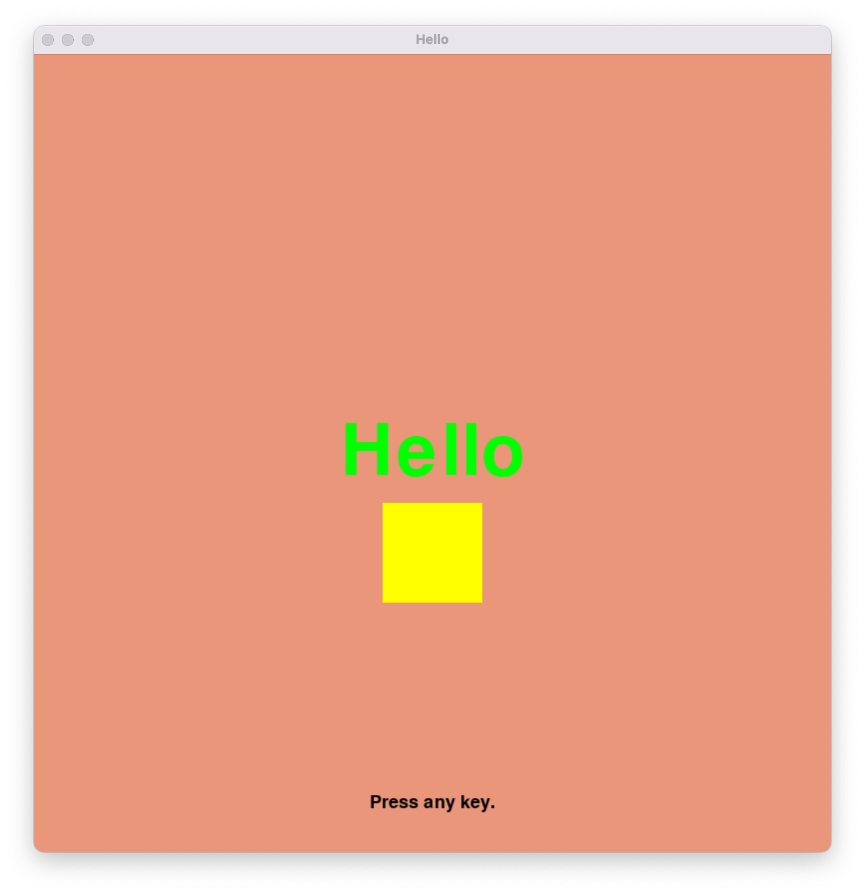

# Pygame Scene

This is an exercise to create an application using Pygame. The application will demonstrate the following elements:

* Displaying a colored background
* Displaying text rendered with from a font
* Displaying a colored rectangle
* Playing a soundtrack
* Listening for and handling events
* Using pip to install an editable packge

Please restrict yourself to the default Python 3 version that ships with Ubuntu 20.

Please use the code provided to meet the requirements of the assignment. Look for comments with the string `TODO` to identify places where you need to add your own code.

In addition to the Python source code, there is an example `setup.py` file that can be used to install your package into your virtual environment.

To assit you in linting, a `.pylintrc` file is included which whitelists the Pygame package.

Please select a soundtrack for this assignment. The Internet Archive has an [archive of chiptunes](https://archive.org/details/Chiptune_Songs_Archive/) which you can use. A few random selections have been placed in `videogame/data`.

The requirements of this exercise are:

1. Create a [Python Virtual Environment](https://docs.python.org/3/tutorial/venv.html).
1. Install Pygame into the virtual environment using pip.
1. Review the contents of `videogame/setup.py`. This is the build configuration for the videogame module.
1. Install the `videogame` package (the directory in the repository) as an editable package using the command `pip install -r videogame`. This command assumes that you are at the root level of the repository. The last parameter of the command must be a relative or full path to the videogame directory.
1. Edit the files `hello.py`, `videogame/__init__.py`, `videogame/game.py`, `videogame/rgbcolors.py`, and `videogame/scene.py` such that the program executes correctly. Please add a header to each file.
1. Add any data files needed for the project to `videogame/data`. Remember to add and commit these files into your repository. Please do not use files that are larger than 10 MB.
1. Freeze the virtual environment using the `pip freeze` command into a file named `requirements.txt`
1. Add `requirements.txt` to your repository and commit it.

_Do not add and comit your Python virtual environment directory._

Below is an example screenshot of the completed project.

# Don't Forget

Please remember that:

* You need to put a header in every file per the [instructions](https://docs.goo
gle.com/document/d/1OgC3_82oZHpTvoemGXu84FAdnshve4BCvtwaXZEJ9FY/edit?usp=sharing) shared in Canvas.
* You need to follow [PEP-8](https://www.python.org/dev/peps/pep-0008/); use linters and style checkers such as `pycodestyle`, `pylint`, and `black`.
* You need to test your program. If it does not run correctly or if it unplayable then your project will receive poor marks.

# Rubric

This exercise is worth 20 points.

* Python virtual environment requirements file (5 points): contains the required packages to run the project and can be used to recreate the virtual environment

* Functionality (9 points): Your submission shall be assessed for the appropriate constructs and strategies to address the exercise. A program the passes the instructor's tests completely receives full marks. A program that partially passes the instructors tests receives partial-marks. A program that fails the majority or all the tests receives no marks.

* Format & Readability (6 points): Your submission shall be assessed by checking whether your code passess the style and format check, as well as how well it follows the proper naming conventions, and internal documentation guidelines. Git log messages are an integral part of how readable your project is. _Failure to include a header forfeits all marks._

